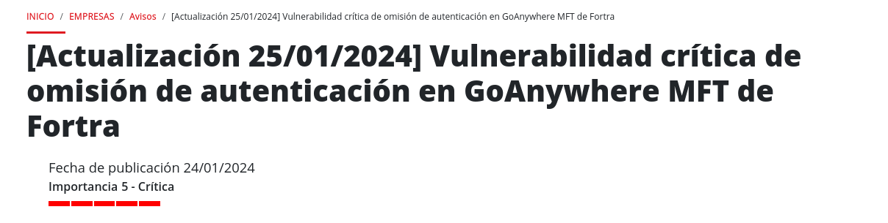
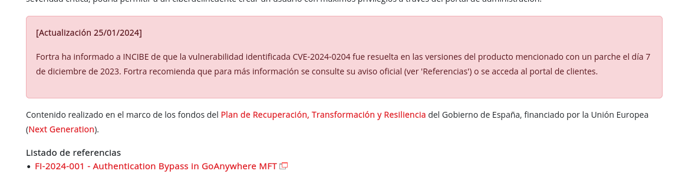
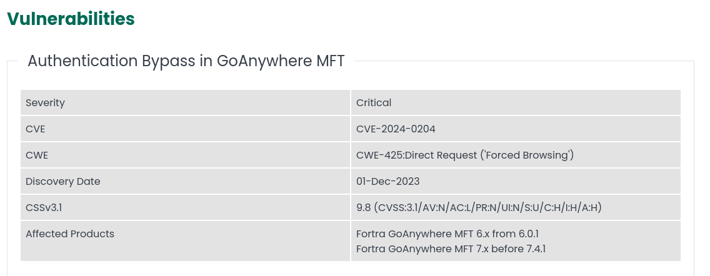
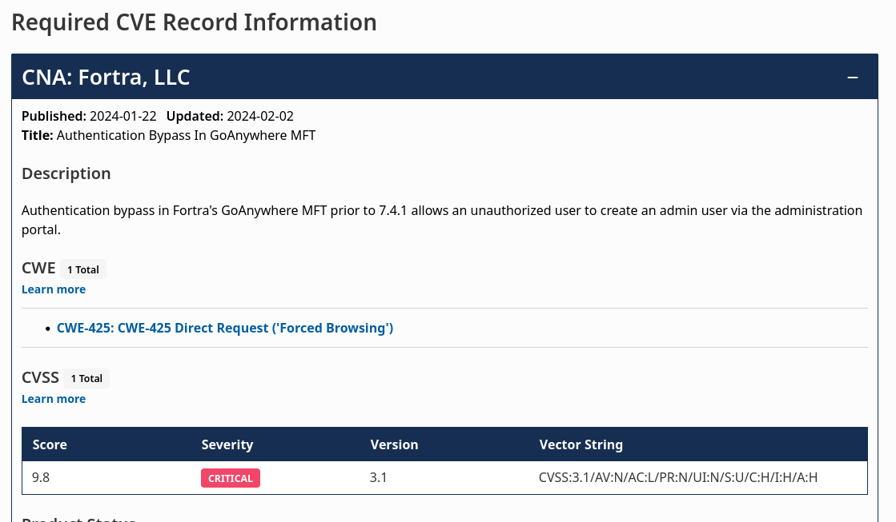
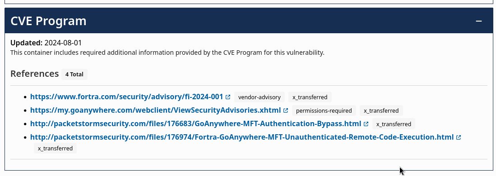

# PPS-Unidad2Actividad1-Aaron

## Realiza el trazado de la vulnerabilidad de la que informa este artículo

### Incibe

Voy a realizar un trazado de la siguiente vulnerabilidad:

En algunas ocasiones en el propio informe de la vulnerabilidad de **Incibe** muestra el CVE de la vulnerabilidad. En los casos que no lo muestra, como este, si hacemos un poco de scroll hacia abajo podemos observar que hay una apartado que se llama **listado de referencias**, en el que podemos encontrar enlaces a otras plataformas donde encontrar información aceca del CVE.

Si accedemos al enlace del listado de referencia, podemos observar más información acerca de la vulnerabilidad como el CVE (vulnerabilidad), CWE (debilidad) y otros datos interesantes.

### Mitre CVE

Con la información obtenida de la página anterior podemos rastrear nueva información acerca de la vulnerabilidad, las debilidades, patrones de ataques y otros datos relevantes.

Podemos obtener información de dos platamos importantes:

- [Mitre CVE](https://www.cve.org/)
- [Nist](https://nvd.nist.gov/)

En mi caso he optado por hacer el rastreo de la vulnerabilidad en la plataforma de [Mitre CVE](https://www.cve.org/CVERecord?id=CVE-2024-0204).

Al acceder al CVE desde Mitre, lo primero que encontramos, es un bloque que contiene información sobre el CVE que muestra los siguientes datos relevantes:

- **CWE**: Es un listado de las debilidades que aprovecha este CVE.
- **CVSS**: Es un estándar de puntuación de criticidad de CVE (En este caso muestra que tiene una criticidad de 9.8/10).
- **CVSS:3.1/AV:N/AC:L/PR:N/UI:N/S:U/C:H/I:H/A:H**: Es el vector de ataque usado para la vulnerabilidad.
- Información de los vendedores del producto afectado.
- Referencias del CVE.

### Mitre CWE

Este CVE según la plataforma de **Mitre CVE** aprovecha una debilidad del listado **CWE** (CWE-425: Direct Request ('Forced Browsing')).

Si accedemos al enlace que nos ofrece la plataforma anterior de Mitre, podemos obtener información sobre la debilidad.

## Crea un repositorio con nombre PPS-Unidad2Actividad1-Tu-Nombre donde desarrolles dicho trazado.
## No te olvides de documentarlo convenientemente con explicaciones, capturas de pantalla, etc.
## Sube a la plataforma, tanto el repositorio comprimido como la dirección a tu repositorio de Github.

