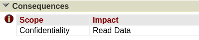

# PPS-Unidad2Actividad1-Aaron

## Realiza el trazado de la vulnerabilidad de la que informa este artículo

### Incibe

Voy a realizar un trazado de la siguiente vulnerabilidad:

En algunas ocasiones en el propio informe de la vulnerabilidad de **Incibe** muestra el CVE de la vulnerabilidad. En los casos que no lo muestra, como este, si hacemos un poco de scroll hacia abajo podemos observar que hay una apartado que se llama **listado de referencias**, en el que podemos encontrar enlaces a otras plataformas donde encontrar información aceca del CVE.

Si accedemos al enlace del listado de referencia, podemos observar más información acerca de la vulnerabilidad como el CVE (vulnerabilidad), CWE (debilidad) y otros datos interesantes.

### Mitre CVE

Con la información obtenida de la página anterior podemos rastrear nueva información acerca de la vulnerabilidad, las debilidades, patrones de ataques y otros datos relevantes.

Podemos obtener información de dos platamos importantes:

- [Mitre CVE](https://www.cve.org/)
- [Nist](https://nvd.nist.gov/)

En mi caso he optado por hacer el rastreo de la vulnerabilidad en la plataforma de [Mitre CVE](https://www.cve.org/CVERecord?id=CVE-2024-0204).

Al acceder al CVE desde Mitre, lo primero que encontramos, es un bloque que contiene información sobre el CVE que muestra los siguientes datos relevantes:

- **CWE**: Es un listado de las debilidades que aprovecha este CVE.
- **CVSS**: Es un estándar de puntuación de criticidad de CVE (En este caso muestra que tiene una criticidad de 9.8/10).
- **CVSS:3.1/AV:N/AC:L/PR:N/UI:N/S:U/C:H/I:H/A:H**: Es el vector de ataque usado para la vulnerabilidad.
- Información de los vendedores del producto afectado.
- Referencias del CVE.

### Mitre CWE

Este CVE según la plataforma de **Mitre CVE** aprovecha una debilidad del listado **CWE** (CWE-425: Direct Request ('Forced Browsing')).

Si accedemos al [enlace](https://cwe.mitre.org/data/definitions/425.html) que nos ofrece la plataforma anterior de Mitre, podemos obtener información sobre la debilidad.

Dentro de la información mostrada en dicha página, podemos tener diferentes vistas, tal y como podemos ver en la imagen siguiente. Si le damos a **Complete** tendremos toda la información visible.

De la información mostrada, podemos extraer, que la debilidad explotada, consiste en que la aplicación web no aplica adecuadamente la autorización adecuada en todas las URL, secuencias de comandos o archivos restringidos.

Las posibles soluciones o mitigaciones que nos ofrecen son las siguientes.

### Patrones de ataque CAPEC

Dentro de la información anterior sobre la debilidad podemos encontrar un apartado donde muestra los posibles **patrones de ataque CAPEC**.

Voy a mostrar el contenido del [CAPEC-127](https://capec.mitre.org/data/definitions/127.html)

Podemos ver cómo se realiza el flujo de ejecución, los requisitos previos, etc. así como las habilidades requeridas para la realización de este patrón de ataque.

Por otra parte también vemos las consecuencias respecto a la integridad, confidencialidad, etc., la lista de debilidades que se pueden explotar con este patrón de ataque, así como las posibles mitigaciones que podemos realizar.

### Descarga del Registro CVE de la vulnerabilidad

El registro de CVE o CVE Record es un registro con información dela vulnerabilidad donde incluye información de dicha vulnerabilidad.

Este registro se utiliza para el tratamiento automatizado de la información, pudiendo ser utilizado por diferentes utilidades de seguridad.

En él está comprendida información en formato xml o JSON sobre CWE, CPE, CAPEC, etc..

Podemos descargarla o acceder a su información, desde la página de cve.org dándole al enlace **View JSON**

